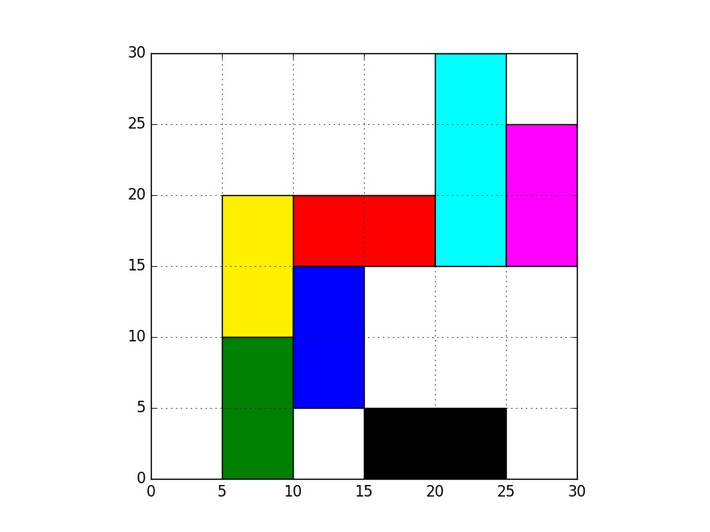
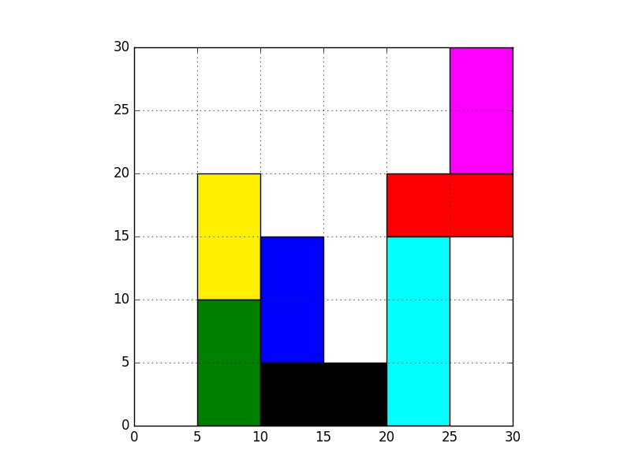

# Rush Hour with BFS and DFS

In rush hour game, one target car (shown in red) should be
moved out of the 6x6 board by moving other cars horizontally or vertically.
An example starting and ending states of a board are shown below.

Starting board             |  Ending board
:-------------------------:|:-------------------------:
  |  

Breadth-first search (BFS) and depth-first search (DFS) algorithms are used with C++ code for this problem.

## File format

Board states are written .txt files as input1.txt etc. Each row has 4 elements.
The first two numbers are ** row and column values of the bottom left corner ** of the cars.
The third number is the length of the car.
The last element is either "h" (horizontal) or "v" (vertical) defines the orientation of the cars.

## Running algorithms

Compiling `rush_hour.cpp` is:

`g++ -std=c++11 rush_hour.cpp -o rush_hour`

There are 3 extra arguments to give while running `rush_hour`.
The first argument is the method (bfs or dfs)
The second argument is input file (starting board state   e.g. input1.txt)
The third argument is output file (** the shortest solution ** as a series of board states   e.g. output1_bfs.txt)

Running `rush_hour` is:

`./rush_hour bfs input1.txt output1_bfs.txt`

or

`./rush_hour dfs input1.txt output1_dfs.txt`

## Simulating

There is Python code provided to simulate blocks based upon output files.

Running `simulate_blocks.py`

`python simulate_blocks.py -i input1.txt -o output1_bfs.txt`

To prevent removing image files of solution steps

`python simulate_blocks.py -i input1.txt -o output1_bfs.txt -r`

Since DFS performs poorly, simulating DFS outputs is painful (Solutions have too much steps)

